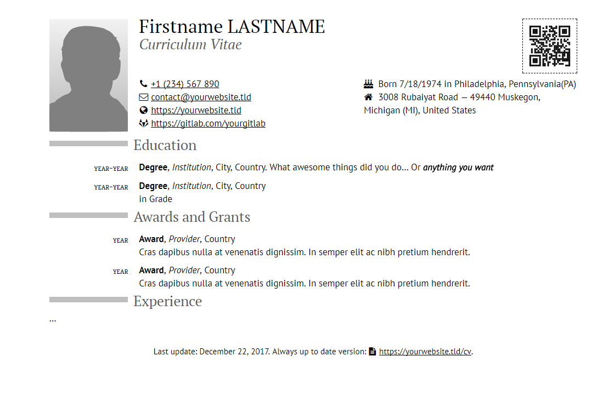
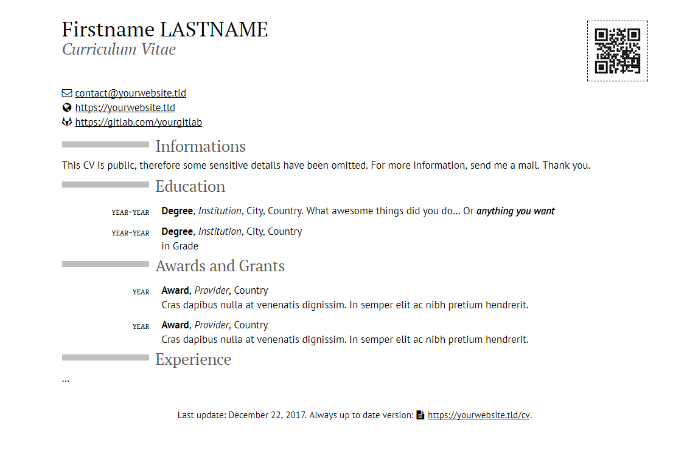

# Pandoc-CV

This project is heavily inspired by Rémi Barraquand's [pandoc-moderncv](https://github.com/barraq/pandoc-moderncv). It is nonetheless an almost full rewrite (for self-education purposes), walking away from Ruby and migrating to a **NodeJS-based pipeline** and **Docker**.

This project allows the user to easily write his/her own *curriculum vitae* in **markdown**, outputting responsive **html5** and matched **pdf**.

## Preview & Screenshots

#### Private CV

|  |
| :----: |
| **Screenshot of the HTML scaffold CV taken for a large screen (private cv).**  |
| See also the [small-screen preview](preview/private-sm.png) or the [pdf file](https://gitlab.com/francesco.spilla/pandoc-cv/raw/master/preview/private.pdf) |

#### Public CV

|  |
| :----: |
| **Screenshot of the HTML scaffold CV taken for a large screen (public cv).**  |
| See also the [small-screen preview](preview/public-sm.png) or the [pdf file](https://gitlab.com/francesco.spilla/pandoc-cv/raw/master/preview/public.pdf) |

## Requirements

You just need the following if you wish to use Docker:

- [Docker](https://www.docker.com/community-edition#/download),
- [Docker Compose](https://docs.docker.com/compose/install/#install-compose).

Otherwise you will need to prepare the environment:

- [NodeJS](https://nodejs.org/) (>= 8),
- [Pandoc](https://pandoc.org/) (>= 2.0)

You then have to install **gulp** `npm install gulp -g` and the required *nodejs packages* `cd app && npm install`. You can then run the gulp pipline via `gulp ***`.

## Getting Started (with Docker)

The project is really easy to use thanks to Docker and Docker Compose. Just open your favorite shell and move in the same folder of the `docker-compose.yml` file.

Just build the `Dockerfile` image with:
    
    $ docker-compose build

then you can get started with the provided scaffolds:

    $ docker-compose run gulp make_scaffolds
    $ docker-compose run gulp

The first command creates a scaffold CV located in the `/app/source` directory, while the second command will build its html version (in `/app/output`), spinning up a Browsersync instance (check gulp's output to find the access URL, click it and select the .html file you wish to preview).

You can then edit your files (in `/app/source`) to your heart's content and instantly watch the browser live-reload with the new changes. When you are done close your gulp (and docker) session with `CTRL+C`.

### Exporting to PDF or HTML

You can then input the following command to generate the PDF files out of the HTML ones (always in the `/app/output` folder):
    
    $ docker-compose run gulp make_pdf

The following command will force the generation of the HTML files (again, in the `/app/output` folder) without the developing environment (web server, live-reloading, ...):

    $ docker-compose run gulp make_html

### Clean your output folder

The output folder is cleaned automatically whenever you run `make_html` or `make_pdf`. You can manually delete the output folder by running:
    
    $ docker-compose run gulp clean
    
### Configuration

#### `gulpfile.js`: paths and locale

Open the `app/gulpfile.js` for configuration. If you don't want to use the default paths you will need to change them here. 

You can also change your locale (default `'en'`). The projects only supports the following as of now: `['en', 'it']`. You can easily add your own locale by translating the `app/assets/templates/cv.en.html` into `app/assets/templates/cv.<YOUR-LOCALE>.html`.

#### `cv.md`: metadata and content

Your CV can be customized with YAML metadata. Metadata are located between two --- separators at the top of the cv.md file and are formated using the YAML format (this is called frontmatter):

    ---
    lang: en
    title: Curriculum Vitae
    firstname: Firstname
    lastname: Lastname
    picture: images/picture.svg
    qrcode: images/qrcode.svg
    resume: https://yourwebsite.tld/cv
    homepage: https://yourwebsite.tld
    github: https://github.com/yourgithub
    gitlab: https://gitlab.com/yourgitlab
    email: contact@yourwebsite.tld
    phone: '+1 (234) 567 890'
    birthdetails:
        date: '7/18/1974'
        place: Philadelphia, Pennsylvania(PA)
    address:
        street: 3008 Rubaiyat Road
        postalcode: 49440
        city: Muskegon, Michigan (MI)
        country: United States
    settings:
        protect-picture: true
        protect-qrcode: false
        protect-birthdetails: true
        protect-address: true
        protect-email: false
        protect-mobile: true
        protect-phone: true
        protect-fax: true
        display-lastupdate: true
    ---

If you don't need a metadata and want to remove it, just delete its line in the frontmatter.

#### Private & Public CV

It is often handy to hide/show specific informations in your CV depending on where it is published/sent. Whenever you generate HTML (or PDF) you will see that it outputs two different files: `app/output/private.html` and `app/ouptut/public.html` (and relative PDFs).

The main difference is that **public** cv will hide *protected metadata*, while **private** cv will show them. You can protect metadata as follows:

    ---
    ...
    settings:
        protect-picture: true # This will show only on private cv
        protect-qrcode: false # This will show only on public cv 
    ---

You can also specify blocks of content (in markdown) to add either *before* or *after* your main content (the one in `app/sources/cv.md`) via the following files in `app/sources/`:

- `before-body-public.md`
- `after-body-public.md`
- `before-body-private.md`
- `after-body-private.md`

By adding those files the project will automatically add them to either your private or public cv when generating both HTML and PDF files. By default only `before-body-public.md` exists.